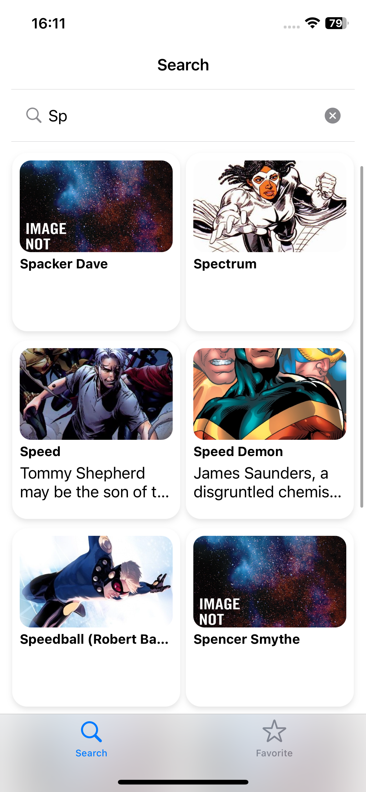
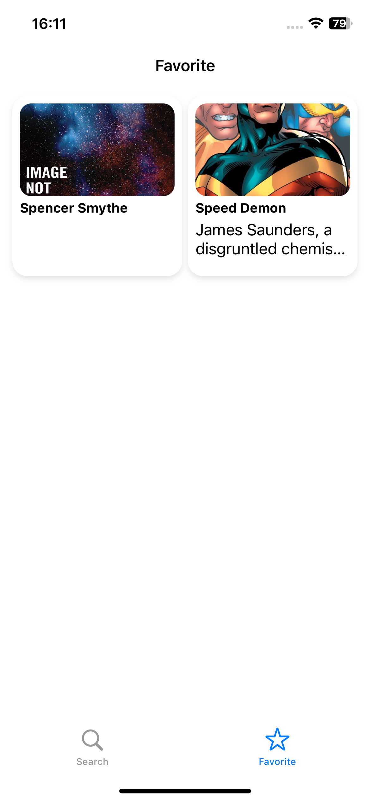
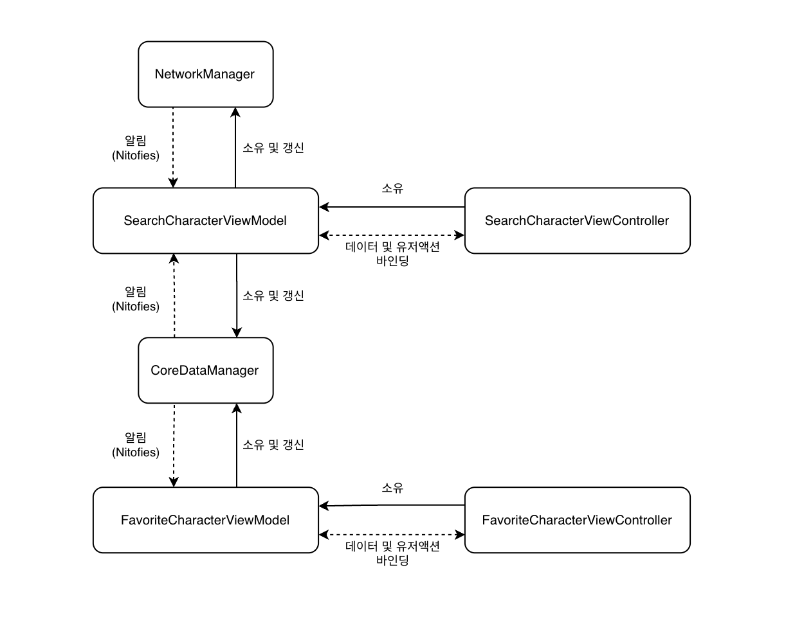
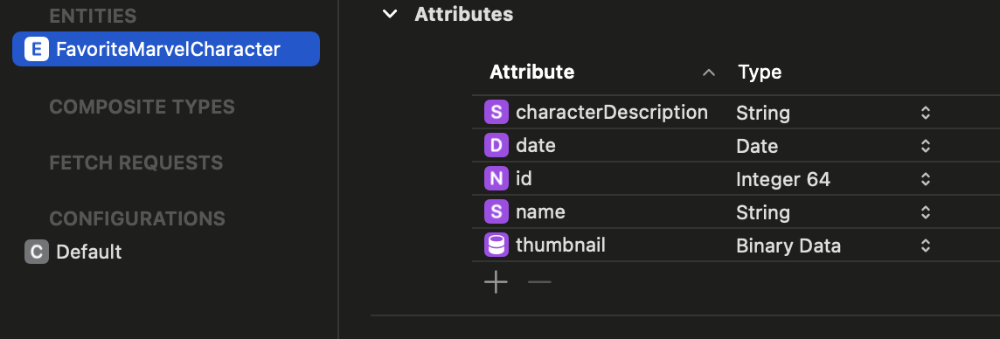

# Marvel Characrers

### [Report](https://www.notion.so/kimjmin/Marvel-Character-cc1f5017437b48fca8629105d3ab0f5e?pvs=4)

### 빌드방법
1. 첨부된 Secret.xcconfig 을 ShopLivee_iOS_Assignment/ShopLivee_iOS_Assignment 경로에 저장한 후 빌드

<br>

# Marvel Character Project Report

# 1. 소개


## 1.1 프로잭트 개요


마블 캐릭터 검색과 즐겨찾기 기능을 제공하는 iOS앱

두 개의 탭을 가진 화면에서 검색 결과와 즐겨찾기 목록을 표시

## 1.2 목표


1. 마블 캐릭터 검색결과 탭
    - 마블 API를 사용하여 캐릭터 검색
        - 검색결과는 한번에 10개씩 표시하며 pagination 돼야함
        - 캐릭터 카드를 누르면 favorite에 저장, 삭제됨
        - 즐겨찾기된 카드는 background 색상 변경
        - 즐겨찾기 모음은 app 종료시에도 유지
        - 검색은 input length가 최소 2글자 이상시 검색, 추가 input이 있으면 추가검색
        - 검색은 0.3초 delay를 주고 입력해야 하며 이전에 호출한 api는 cancel
        - 비동기 작업시 로딩 프로그레스 표시
2. 마블 캐릭터 즐겨찾기 모음 탭
    - 저장된 캐릭터 카드를 누르면 favorite 삭제
    - 저장된 캐릭터 카드가 없을시 tab 중앙에 빈 message 표시
    - 저장된 순서대로 정렬되고 5개 초과 저장시 가장 오래된 카드 삭제
3. XCTest를 이용한 UnitTest
4. Event-Driven을 별도의 Library 사용하지 않고 구현

# 2. 프로젝트 설명


## 2.1 스크린샷

|Search|Favorite|
| --- | --- |
| <p float="none"></p> | <p float="none"></p> |
# 3. 개발과정


## 3.1 개발툴 및 기술스택


- **Programming Language**: `Swift`
- **IDE**: `Xcode 15.2`
- **deployment Target**: `iOS 13.0`
- **Framework & Library**: `UIKit (Code base)` `SnapKit` `CoreData` `XCTest` `SDWebImage` `Lottie`

## 3.2 Architecture

<p float="none"></p>

1. Manager
    - NetworkMakager
        - api call을 통해 Charactre 모델을 가져옴
    - CoreDataManager
        - CoreData를 사용하여 로컬데이터 작업 처리
2. ViewModel
    - SearchCharacterViewModel
        - CoreDataModel 및 NetworkModel을 소유
        - CoreDataModel 및 NetworkMode한테 알림을 받아서 MarvelCharacter 및 FavoriteMarvelCharacter 모델을 관리하며 해당 모델이 변경될 경우 이벤트 방출
    - FavoriteCharacterViewModel
        - CoreDataViewModel 소유
        - CoreDataModel한테 알림을 받아서 FavoriteMarvelCharacter 모델을 관리하며 해당 모델이 변경될 경우 이벤트 방출
    
    SearchCharacterViewModel, FavoriteCharacterViewModel은 같은 CoreDataManager를 소유
    
    이는 CoreDataManager에서 발생한 알림을 두 ViewModel이 동시에 받아야 하기 때문
    
3. ViewController
    - 각 ViewController들은 같은 이름의 ViewModel을 소유하고 있으며 ViewModel에서 이벤트가 발생시 이를 감지하여 UI를 업데이트

# 4. 구현 세부사항

## 4.1 마블 API key 관리

Secret.xcconfig 파일 생성 후 APIkey 입력 및 Target의 Info.plist에 등록시켜서 사용

외부유출을 막기위해 .gitignore 파일을 통해 해당파일을 제외

- 코드
    
    ```swift
     extension Bundle {
        var PUBLIC_KEY: String? {
            infoDictionary?["PUBLIC_KEY"] as? String
        }
        
        var PRIVATE_KEY: String? {
            infoDictionary?["PRIVATE_KEY"] as? String
        }
    }
    ```
    

## 4.2 네트워크 통신


### 4.2.1 Resource 구조체

---

URL 및 파라미터를 쉽게 관리하기 위해서 사용

생성자로 base, path, params를 초기화하고 urlRequest 계산속성을 통해 URLRequest 객체를 생성

- 코드
    
    ```swift
    // Manager/Network/Resource.swift
    
    struct Resource {
        private var base: String
        private var path: String
        private var params: [String: String]
        
        var urlRequest: URLRequest? {
            guard var urlComponents = URLComponents(string: base + path) else { return nil }
            let queryItems = params.map {
                URLQueryItem(name: $0.key, value: $0.value)
            }
            urlComponents.queryItems = queryItems
            
            guard let url = urlComponents.url else { return nil }
            let request = URLRequest(url: url)
            
            return request
        }
        
        init(
            base: String,
            path: String,
            params: [String : String]
        ) {
            self.base = base
            self.path = path
            self.params = params
        }
    }
    
    let resource = Resource(
    	base: "https://gateway.marvel.com:443",
    	path: "/v1/public/characters",
    	params: [
    		"nameStartsWith": query,
    		"ts": ts,
    		"apikey": publicKey,
    		"hash": hashKey,
    		"limit": String(apiCallLimitCount),
    		"offset": String(pagenationCount)
    	]
    )
    ```
    

### 4.2.2 NetworkManager 클래스

---

URLSession을 사용하여 네트워크 요청을 수행

- `getMarvelCharacters(resource:)` : 주어진 Resource를 사용하여 마블 캐릭터를 가져옴
    - 진행중인 task를 저장해뒀다가 다른 task가 들어오면 기존 task를 **cancel**
- `getImageData(url:)` : 주어진 URL에서 이미지 데이터를 비동기적으로 가져옴
- 코드
    
    ```swift
    // Manager/Network/NetworkManager.swift
    
    var requestTask: Task?
    
    private func getMarvelCharacters(request: URLRequest?) async throws -> [MarvelCharacter] {
        guard let request = request else {
            throw URLError(.badURL)
        }
        let (data, response) = try await session.data(for: request)
        
        guard (response as? HTTPURLResponse)?.statusCode == 200 else {
            throw URLError(.badServerResponse)
        }
        
        do {
            let characters = try JSONDecoder().decode(MarvelCharacterAPIResult.self, from: data)
            return characters.data.results
        } catch {
            print(error.localizedDescription)
        }
        
        return []
    }
    
    func getMarvelCharacters(resource: Resource) throws {
        requestTask?.cancel()
        requestTask = Task {
            let characters = try await getMarvelCharacters(request: resource.urlRequest)
            characterPublisher.send(characters)
        }
    }
    
    func getImageData(url: URL?) async throws -> Data {
        guard let url = url else {
            throw URLError(.badURL)
        }
        
        let (data, response) = try await session.data(from: url)
        
        guard (response as? HTTPURLResponse)?.statusCode == 200 else {
            throw URLError(.badServerResponse)
        }
        
        return data
    }
    ```
    

### 4.2.3 api 무분별한 call 막기

---

1. 0.3초 delay 및 최소 2글자 이상 입력될시 통신
    
    글자가 입력될때마다 Publisher가 발행되는데 이때 **debounce** 오퍼레이터로 0.3초 이상 추가입력이 없을경우에 값을 방출하도록 설정
    
    **Subscriber**에서 방출된 글자를 받았을때 2글자 이상일 경우에 api call
    
    - 코드
        
        ```swift
        // ViewController/SearchCharacterViewController/SearchCharacterViewModel.swift Line 85
        
        searchCharacterNamePublisher
        		// 0.3초간 추가입력이 없을경우 방출
            .debounce(for: 0.3, queue: .main)
            .sink { [weak self] text in
                if text.count >= 2 {
        	        // api call
                }
            }.store(in: &subscriptions)
        ```
        
    - 참고영상
        
        [marvelcharacter.m4v](https://prod-files-secure.s3.us-west-2.amazonaws.com/f33d16eb-3048-4a85-85eb-f7568b96dc88/88a04c8b-ab62-4179-b1d2-202767dceefb/marvelcharacter.m4v)
        
        원활한 테스트를 위해 debounce를 2초로 설정했습니다
        
2. api가 호출됐을때 이전에 호출한 api cancel
    
    4.2.2 참고
    
3. 더이상 받아올 데이터가 없을경우
    
    무한스크롤로 pagination을 구현했기 때문에 더이상 받아올 character가 없을때도 스크롤을 하면 api call을 함
    
    따라서 api call 했을때 받아온 marvel character가 존재하지 않을경우 마지막 character까지 다 받아온거라고 판단하고 더이상 api call을 하지 않도록 구현
    
    - 코드
        
        ```swift
        // ViewController/SearchCharacterViewController/SearchCharacterViewModel.swift
        
        // Line 86
        networkManager.characterPublisher
            .receive(on: DispatchQueue.main)
            .sink { [weak self] characters in
                self?.marvelCharacters.append(contentsOf: characters)
                // characters 배열이 없을경우 페이지네이션 종료
                if characters.isEmpty {
                    self?.isDonePagenation = true
                }
            }.store(in: &subscriptions)
            
        // Line 101
        func getMarvelCharacters(query: String? = nil) {
        		// pagination이 끝났을 경우 함수가 호출되도 api call하지 않고 바로 return
            if isDonePagenation { return }
        		
        		...
        }
        
        ```
        

### 4.2.4 pagination

---

api call을 통해 marvel character를 받아오는데 성공하면 paginationCount를 10씩 플러스 (한번에 10개씩 받아오기 때문)

api URL의 offset파라미터에 paginationCount를 값으로 사용

만약 검색어가 바뀐다면 다시 처음부터 받아와야 하기 때문에 paginationCount도 0으로 초기화

## 4.3 CoreData


Favorite Character를 로컬스토리지에 저장하기 위해 CoreData 사용

- CoreData 사용이유
    
    처음에 로컬스토리지에 저장하기 위해 고민했던 프레임워크는 Realm, FileManager, CoreData 였습니다
    
    CoreData같은경우는 CloudKit 을 사용한 동기화나 Extension을 사용할때 마이그레이션하기가 편리하기 때문에 추후 앱 확장성을 고려하여 CoreData를 선택했습니다
    

### 4.3.1 모델 Entity

---

<p float="none"></p>

CoreData의 경우 저장방식이

1. container 내부 context에 객체생성
2. 해당 객체의 attribute 수정
3. context save

로 나뉘어져 있음

위 과정중 2번을 손쉽게 하기 위해서 `FavoriteMarvelCharacterEntity` 모델을 만들어줌

- 코드
    
    ```swift
    // Model/CoreData/FavoriteMarvelCharacter+CoreDataClass.swift
    
    struct FavoriteMarvelCharacterEntity {
        let id: Int64
        let name: String
        let description: String
        let date: Date
        let thumbnail: Data
    }
    
    favoriteCharacter.id = entity.id
    favoriteCharacter.name = entity.name
    favoriteCharacter.characterDescription = entity.description
    favoriteCharacter.thumbnail = entity.thumbnail
    favoriteCharacter.date = entity.date
    ```
    

### 4.3.2 저장

---

Favorite Character 카드의 max count는 5개이고 5개 초과 저장시 가장 오래된 카드를 삭제한다

- 코드
    
    ```swift
    // Manager/CoreDataManager
    
    func saveFavoriteCharacter(entity: FavoriteMarvelCharacterEntity) {
        let favoriteCharacter = FavoriteMarvelCharacter(context: persistentContainer.viewContext)
        favoriteCharacter.id = entity.id
        favoriteCharacter.name = entity.name
        favoriteCharacter.characterDescription = entity.description
        favoriteCharacter.thumbnail = entity.thumbnail
        favoriteCharacter.date = entity.date
        
        do {
            try persistentContainer.viewContext.save()
            var previousCharacterArray = favoriteCharacterPublisher.value
            
            previousCharacterArray.append(favoriteCharacter)
            if previousCharacterArray.count > 5 {
                favoriteCharacterPublisher.send(try removeOldestCharacter(characters: previousCharacterArray))
            } else {
                favoriteCharacterPublisher.send(previousCharacterArray)
            }
        } catch {
            persistentContainer.viewContext.rollback()
        }
    }
    
    private func removeOldestCharacter(characters: [FavoriteMarvelCharacter]) throws -> [FavoriteMarvelCharacter] {
        var characters = characters
        let oldestCharacter = characters.min {
            $0.date ?? Date() < $1.date ?? Date()
        }
        
        if let oldestCharacter = oldestCharacter {
            persistentContainer.viewContext.delete(oldestCharacter)
            try persistentContainer.viewContext.save()
            characters.removeAll { $0.id == oldestCharacter.id }
        }
        
        return characters
    }
    ```
    

## 4.4 UI


### 4.4.1 SearchCharacterViewController의 character card가 favorite card일 경우 card색 변경

---

favorite 모음에 character를 저장할때 **id**를 api call을 통해 받아온 character 모델의 id로 저장

api call을 해서 받아온 character 모델의 id가 CoreData에 저장된 character 모델의 id랑 일치할 경우 character card 색상 변경

- 코드
    
    ```swift
    // ViewController/SearchCharacterViewController/SearchCharacterViewModel.swift Line 133
    
    func checkExistInFavoriteCharacter(index: Int) -> Bool {
        let character = marvelCharacters[index]
        
        return favoriteMarvelCharacters.contains { $0.id == character.id }
    }
    
    ```
    
    ```swift
    // ViewController/SearchCharacterViewController/SearchCharacterViewController.swift Line 206
    
    cell.configureView(
        model: viewModel.marvelCharacters[indexPath.row],
        isFavorite: viewModel.checkExistInFavoriteCharacter(
            index: indexPath.row
        )
    )
    ```
    

### 4.4.2 Loading progress

---

Loading progress animation을 위해 lottie 파일 사용

lottie 파일을 재생시켜주기 위해 `Lottie` library 설치

앱에서는 총 3군데에서 비동기 작업을 함

1. api call해서 character model을 받아올때
    
    collectionView 의 section[1] 에 위치
    
    api call할때 애니메이션 시작했다가 api를 받아오고 나면 종료
    
2. character card의 thumbnail 보여줄 이미지를 받아올때 (캐시된게 없을경우)
    
    thumbnail image의 중앙에 위치
    
    character card의 cell이 configure될때 애니메이션 시작했다가 썸네일을 받아오면 종료
    
3. favorite character에 저장할 thumbnail 이미지 데이터를 받아올때 (캐시된게 없을경우)
    
    view의 중앙에 위치
    
    favorite character를 저장할때 애니메이션 시작했다가 저장이 완료되면 종료
    

### 4.4.3 무한스크롤

---

pagination을 위해 collectionView의 하단으로 스크롤하면 api call을 해야함

**UICollectionViewDelegate**의 collectionView(_:willDisplay:forItemAt:) 함수를 통해서 보여질 cell의 index가 현재 받아온 character 의 개수랑 일치할 경우 api call 수행

- 코드
    
    ```swift
    // ViewController/SearchViewController.swift Line 235
    
    func collectionView(_ collectionView: UICollectionView, willDisplay cell: UICollectionViewCell, forItemAt indexPath: IndexPath) {
        if indexPath.row + 1 == viewModel.marvelCharacters.count {
            viewModel.getMarvelCharacters()
        }
    }
    ```
    

# 5. Event-Driven

---

Event-Driven이란 소프트웨어가 이벤트에 반응하여 동작하는 방식의 프로그래밍 패러다임

원래 Event-Driven을 위해 Combine 을 사용했으나 별도의 Library를 사용하지 않고 구현하기 위해 Combine과 유사하게 구현해 봤습니다

## 5.1 SLPassthroughSubject<Output>


- 기본 발행자
- 구독자들을 관리하고 값을 전송
- 코드
    
    ```swift
    class SLPassthroughSubject<Output> {
        typealias Subscriber = (Output) -> Void
        
        // 구독된 Subscriber
        private var subscribers: [Subscriber] = []
        
        func subscribe(_ subscriber: @escaping Subscriber) {
            subscribers.append(subscriber)
        }
        
        func send(_ value: Output) {
            for subscriber in subscribers {
                subscriber(value)
            }
        }
        
        @discardableResult
        func sink(_ receiveValue: @escaping (Output) -> Void) -> SLAnyCancellable {
            let subscriber = SLSubscriber(receiveValue)
            subscribe { value in
                subscriber.receive(value)
            }
            
            let cancellable = SLAnyCancellable { [weak self] in
                self?.subscribers.removeAll { $0 as AnyObject === subscriber }
                subscriber.cancel()
            }
            
            return cancellable
        }
    }
    ```
    

## 5.2 SLCurrentValueSubject<Output>


- SLPassthroughSubject 의 확장형태
- 현재 값을 저장하고 관리
- 새로운 구독자한태 즉시 현재값을 전달
- 코드
    
    ```swift
    class SLCurrentValueSubject<Output> {
        typealias Subscriber = (Output) -> Void
        
        private var subscribers: [Subscriber] = []
        private var currentValue: Output
        
        init(_ value: Output) {
            self.currentValue = value
        }
        
        var value: Output {
            get {
                return currentValue
            }
            set {
                currentValue = newValue
                send(newValue)
            }
        }
        
        func subscribe(_ subscriber: @escaping Subscriber) {
            subscribers.append(subscriber)
            subscriber(currentValue)
        }
        
        func send(_ value: Output) {
            currentValue = value
            for subscriber in subscribers {
                subscriber(value)
            }
        }
        
        @discardableResult
        func sink(_ receiveValue: @escaping (Output) -> Void) -> SLAnyCancellable {
            let subscriber = SLSubscriber(receiveValue)
            subscribe { value in
                subscriber.receive(value)
            }
            
            let cancellable = SLAnyCancellable { [weak self] in
                self?.subscribers.removeAll { $0 as AnyObject === subscriber }
                subscriber.cancel()
            }
            
            return cancellable
        }
    }
    ```
    

## 5.3 SLSubscriber<Input>


- 구독자
- 값을 받아서 처리하는 로직을 가지고 있음
- 코드
    
    ```swift
    class SLSubscriber<Input> {
        private let receiveValue: (Input) -> Void
        private var isCancelled = false
        
        init(_ receiveValue: @escaping (Input) -> Void) {
            self.receiveValue = receiveValue
        }
        
        func receive(_ value: Input) {
            guard !isCancelled else { return }
            receiveValue(value)
        }
        
        func cancel() {
            isCancelled = true
        }
    }
    ```
    

## 5.4 SLAnyCancellable


- 구독을 cancel 할 수 있는 기능 제공
- Hashable 프로토콜을 채택하여 Set에 저장가능
- deinit때 구독 cancel
    - Set을 초기화할때 구독을 cancel 하기 위해
- 코드
    
    ```swift
    class SLAnyCancellable {
        private let cancelAction: () -> Void
        private var isCancelled = false
        
        init(_ cancelAction: @escaping () -> Void) {
            self.cancelAction = cancelAction
        }
        
        func cancel() {
            guard !isCancelled else { return }
            isCancelled = true
            cancelAction()
        }
        
        func store(in set: inout Set<SLAnyCancellable>) {
            set.insert(self)
        }
        
        deinit {
            cancel()
        }
    }
    
    extension SLAnyCancellable: Hashable {
        static func == (lhs: SLAnyCancellable, rhs: SLAnyCancellable) -> Bool {
            return lhs === rhs
        }
        
        func hash(into hasher: inout Hasher) {
            hasher.combine(ObjectIdentifier(self))
        }
    }
    ```
    

## 5.5 Operator


### 5.5.1 debounce(for: queue) → Subject<Output>

---

- 연속적으로 발생하는 이벤트 중 마지막 이벤트만 처리
- 코드
    
    ```swift
    **func debounce(for interval: TimeInterval, queue: DispatchQueue = .main) -> SLCurrentValueSubject<Output> {
        let debouncedPublisher = SLCurrentValueSubject<Output>(value)
        var workItem: DispatchWorkItem?
        
        self.subscribe { value in
            workItem?.cancel()
            workItem = DispatchWorkItem {
                debouncedPublisher.send(value)
            }
            queue.asyncAfter(deadline: .now() + interval, execute: workItem!)
        }
        
        return debouncedPublisher
    }**
    ```
    

### 5.5.2 receive(on:)

---

- 지정된 DispatchQueue로 이벤트 전송
- 코드
    
    ```swift
    func receive(on queue: DispatchQueue) -> SLCurrentValueSubject<Output> {
        let receivedPublisher = SLCurrentValueSubject<Output>(value)
        
        self.subscribe { value in
            queue.async {
                receivedPublisher.send(value)
            }
        }
        
        return receivedPublisher
    }
    ```
    

# 6. 테스트


앱의 비즈니스 로직인 NetworkManager 및 CoreDataManager를 XCTest를 통해서 Unit Test 진행

## 6.1 NetworkManager


api call을 테스트하기 위해서 실제 네트워크 요청을 할 경우 외부 환경에 의해서 테스트가 실패할 수 있음

또한 만약 POST 요청을 테스트 하는 경우 테스트 코드로 인해 실제 프로덕션 환경에 문제가 생길 가능성 있음

테스트 코드는 외부 환경에 영향을 받으면 안되기 때문에 **MockURLSession**을 만들어서 테스트 진행

1. URLSessionProtocol을 만들어서 URLSession 및 MockURLSession에 채택
2.  NetworkManager의 타입을 URLSessionProtocol로 설정
3. 테스트할때 NetworkManager의 session을 MockURLSession으로 초기화
    
    → 테스트할때 MockURLSeession으로 진행되기 때문에 실제 네트워크 통신을 하지않아 외부 환경에 영향이 없음
    
- 코드
    
    ```swift
    // Manager/Network/MockURLSession.swift
    
    protocol URLSessionProtocol {
        func data(for request: URLRequest) async throws -> (Data, URLResponse)
        func data(from url: URL) async throws -> (Data, URLResponse)
    }
    
    extension URLSession: URLSessionProtocol { }
    
    class MockURLSession: URLSessionProtocol {
        var data: Data?
        var response: URLResponse?
        var error: Error?
    
        func data(for request: URLRequest) async throws -> (Data, URLResponse) {
            if let error = error {
                throw error
            }
            guard let data = data, let response = response else {
                throw URLError(.badServerResponse)
            }
            return (data, response)
        }
    
        func data(from url: URL) async throws -> (Data, URLResponse) {
            if let error = error {
                throw error
            }
            guard let data = data, let response = response else {
                throw URLError(.badServerResponse)
            }
            return (data, response)
        }
    }
    ```
    
    ```swift
    // Manager/Network/NetworkManager.swift
    
    final class NetworkManager: NetworkManagerProtocol {
    	private let session: URLSessionProtocol
    
    	init(session: URLSessionProtocol = URLSession(configuration: .default)) {
            self.session = session
        }
    }
    ```
    
    ```swift
    // 테스트시 NetworkManager의 session을 MockURLSession으로 초기화
    override func setUp() {
        super.setUp()
        mockSession = MockURLSession()
        networkManager = NetworkManager(session: mockSession)
    }
    ```
    
- test 목록
    - api call 성공 했을때 data가 MarvelCharacter 모델로 잘 디코딩 되는지 여부
    - api call 실패했을때 error 가 잘 throws 되는지

## 6.2 CoreDataManager


테스트를 위해 실제 앱의 Container를 사용할 경우 테스트 코드로 인해 앱의 Container에 문제가 생길 가능성 있음

따라서 Container의 type을 **NSInmemoryStoreType**으로 설정해서 실제 앱의 Container랑 관계없이 테스트 할 수 있도록 함

- 코드
    
    ```swift
    override func setUp() {
        super.setUp()
        subscriptions = Set<SLAnyCancellable>()
        persistentContainer = NSPersistentContainer(name: "FavoriteMarvelCharacter")
        let description = NSPersistentStoreDescription()
        // type을 NSInMemoryStoreType으로 지정
        description.type = NSInMemoryStoreType
        persistentContainer.persistentStoreDescriptions = [description]
        persistentContainer.loadPersistentStores { _, error in
            XCTAssertNil(error)
        }
        
        coreDataManager = CoreDataManager(persistentContainer: persistentContainer)
    }
    ```
    
- test 목록
    - CoreData에서 character 모델이 잘 가져와 지는지 여부
    - CoreData에 character 모델이 잘 저장되는지 여부
    - CoreData에 character 모델이 5개를 초과해서 저장됐을때 가장 오래된 모델이 잘 삭제되는지 여부
    - CoreData에서 character 모델이 잘 삭제되는지 여부

# 7. 결론


## 7.1 요약


마블 API를 활용한 검색 및 즐겨찾기 기능을 구현하였습니다

즐겨찾기를 내부 저장소에 저장하기 위해 CoreData를 사용하였습니다

Event-Driven을 위해 Combine Library와 유사하게 구현하여 사용했으며 XCTest를 통해 앱의 비즈니스 로직인 NetworkManager 및 CoreDataManager를 UnitTest 했습니다

## 7.2 배운 점


1. 실제 앱에서의 XCTest를 통한 Unit Test 경험
    
    이번 프로젝트를 통해 처음으로 실제 앱에서 XCTest를 사용하여 Unit Test를 진행해보았습니다. 특히, Combine을 직접 구현한 SLCurrentValueSubject로 교체한 후 테스트를 실행했을 때, 초기에는 실패가 발생했습니다. 그러나 테스트 결과를 통해 문제의 원인을 빠르게 파악할 수 있었습니다. 이 경험을 통해 앱 개발 시 테스트 코드의 중요성을 깊이 깨닫게 되었습니다. 또한, 외부 환경과 상호 작용하는 테스트를 위해 Mock 객체를 만드는 방법도 배울 수 있었습니다.
    
2. Combine의 내부 구조에 대한 이해
    
    그동안 반응형 프로그래밍을 위해 Combine을 사용하기만 했지, 그 내부 구조에 대해서는 충분히 이해하지 못하고 있었습니다. 그러나 이번에 Combine을 직접 구현하면서 이벤트가 전달되고 수신되는 방식에 대해 명확하게 이해하게 되었습니다. 이를 통해 반응형 프로그래밍의 기본 원리와 Combine의 작동 방식에 대해 더 깊이 있는 지식을 습득할 수 있었습니다.
    

이와 같은 경험을 통해 실제 애플리케이션 개발 과정에서 테스트와 내부 구조에 대한 이해가 얼마나 중요한지를 실감하게 되었으며, 앞으로의 개발에 큰 도움이 될 것입니다.